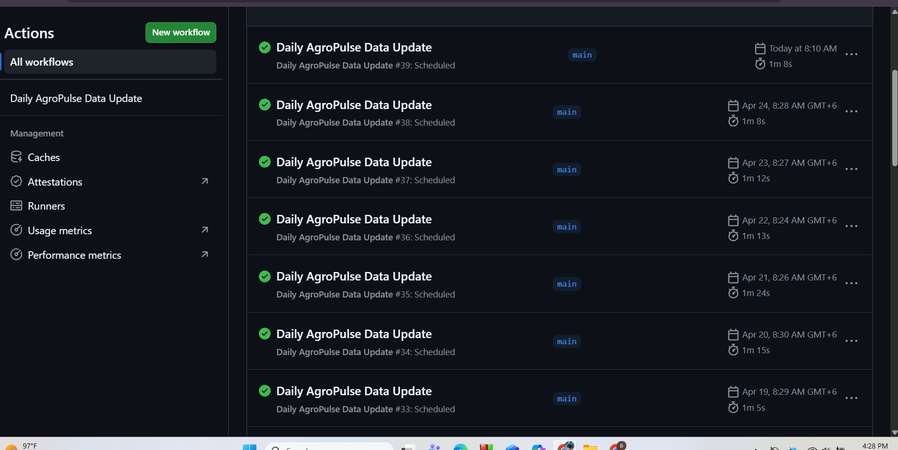
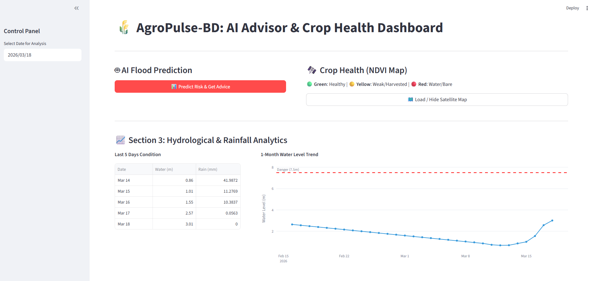
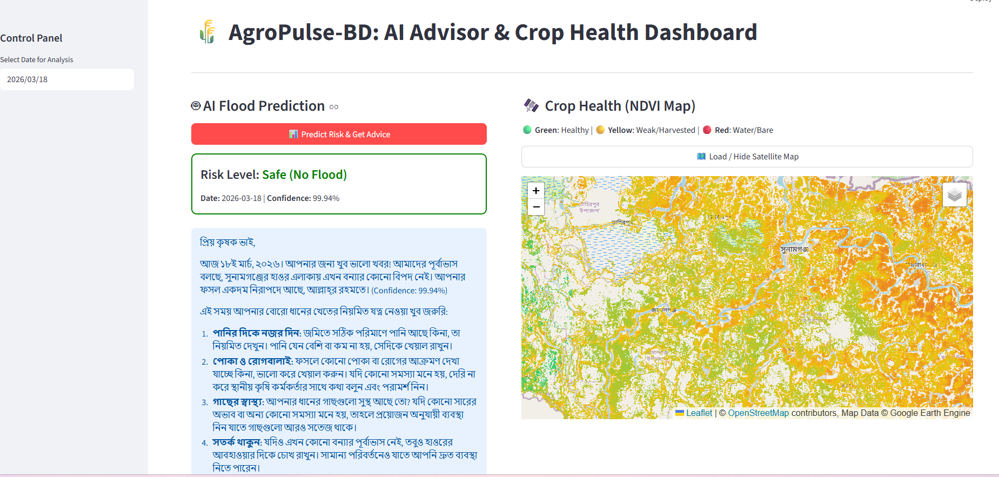

# AgroPulse-BD: Automated Flood Prediction & Crop Monitoring

AgroPulse-BD is an AI-powered environmental decision support system specifically designed for the **Sunamganj Haor region** in Bangladesh. By integrating multi-modal satellite imagery with deep learning time-series models, the system provides impact-based flood forecasting and real-time crop health monitoring to assist local stakeholders and farmers.

---

## 🏗️ System Architecture & Automation

The system is built on a decoupled architecture to ensure scalability and efficient processing of heavy geospatial datasets. 

### 🔄 Automated Data Ingestion
A key highlight of the system is the **Daily Data Pipeline** powered by GitHub Actions. As shown in the workflow logs below, the system automatically fetches multi-source data (Sentinel-1 SAR, Sentinel-2 Optical, and Landsat) every morning. This ensures the model always operates on the most recent environmental telemetry without manual intervention.


*Figure 1: GitHub Actions executing the daily scheduled data fetch and synchronization pipeline.*

---

## 🛰️ How It Works (The Pipeline)

1.  **Data Acquisition & Processing:** The system monitors environmental variables including precipitation and river discharge, merging them with satellite-derived indices.
    * **SAR (Sentinel-1):** Essential for flood mapping as it penetrates cloud cover during the monsoon season.
    * **NDVI (Sentinel-2):** Calculated to monitor crop vigor and identify areas under stress.

2.  **Predictive Modeling:** The **Bi-LSTM model** processes temporal sequences of weather data. Unlike standard LSTMs, the bidirectional approach allows the model to learn patterns from both past and future states in the time series, providing superior accuracy in detecting sudden flash flood onsets.

3.  **AI-Powered Advisory:** Once a risk is identified, the backend sends the technical data to **Google Gemini**. The LLM contextualizes the threat based on the current crop cycle and generates localized, human-readable advice in Bengali.

---

## 🖥️ Frontend: Interactive Dashboard
The frontend is built with **Streamlit**, designed to make complex satellite and hydrological data accessible to non-technical users.

### 📊 Hydrological & Rainfall Analytics
The dashboard provides a deep dive into the 1-month water level trends against a specific **Danger Threshold (7.5m)**. This visual aid allows users to see the trajectory of rising waters relative to historical norms.


*Figure 2: Real-time water level trends and historical rainfall data table.*

### 🌾 AI Advisor & NDVI Spatial Mapping
The interface features a dual-pane system for actionable insights:
* **AI Flood Prediction:** Displays the risk level, date, and confidence score, followed by a localized advisory panel.
* **NDVI Crop Health Map:** An interactive Leaflet/Folium map that renders vegetation indices:
    * 🟢 **Green:** Healthy Crops
    * 🟡 **Yellow:** Weak/Harvested
    * 🔴 **Red:** Water/Bare land


*Figure 3: Impact-based advisory and interactive geospatial NDVI visualization.*

---

## 🚀 Setup & Installation

### Prerequisites
* Python 3.9+
* FastAPI & Uvicorn
* Streamlit
* TensorFlow/PyTorch (for Bi-LSTM inference)

### 1. Clone the Repository
```bash
git clone [https://github.com/bappyBDN/AgroPulse-BD.git](https://github.com/bappyBDN/AgroPulse-BD.git)
cd AgroPulse-BD
